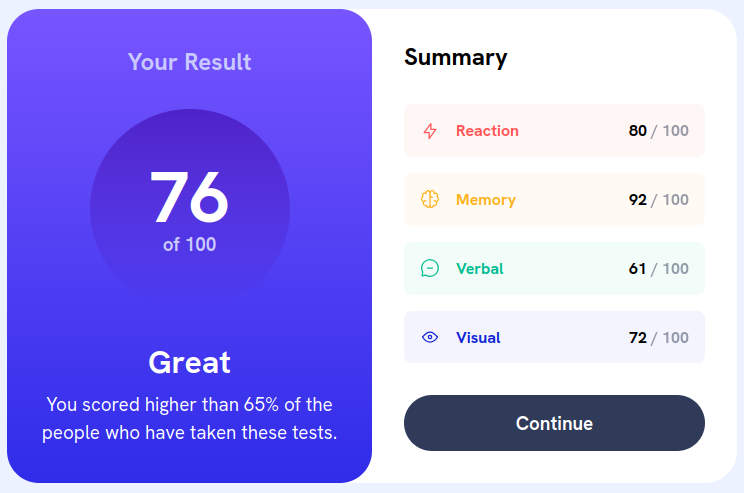
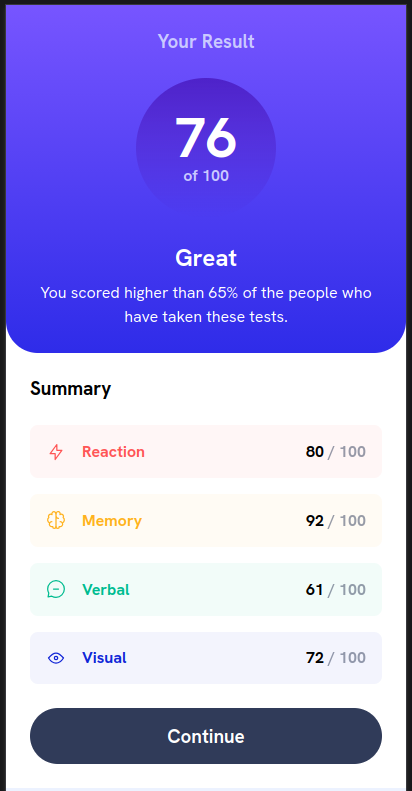

# Frontend Mentor - Results summary component solution

This is a solution to the
[Results summary component challenge on Frontend Mentor](https://www.frontendmentor.io/challenges/results-summary-component-CE_K6s0maV).
Frontend Mentor challenges help you improve your coding skills by building realistic projects.

## Table of contents

- [Overview](#overview)
    - [The challenge](#the-challenge)
    - [Screenshot](#screenshot)
    - [Links](#links)
- [My process](#my-process)
    - [Built with](#built-with)
    - [What I learned](#what-i-learned)
    - [Continued development](#continued-development)
    - [Useful resources](#useful-resources)

## Overview

### The challenge

Users should be able to:

- View the optimal layout for the interface depending on their device's screen size
- See hover and focus states for all interactive elements on the page
- **Bonus**: Use the local JSON data to dynamically populate the content

### Screenshot

**Desktop Layout**



**Mobile Layout**



**Active Button State**


**Commentary**

I'm reasonably happy with the results. The styling was less my focus on this submission as it was my
first implementation using React. There was a lot to learn about project scaffolding, JS/TS
transpiling, interaction between TS and React components, build systems, different JS APIs, etc.

### Links

- Solution URL:
  [https://github.com/Sclata/results-summary-component-main](https://github.com/Sclata/results-summary-component-main)
- Live Site URL: [https://res-summ-comp-fem.netlify.app/](https://res-summ-comp-fem.netlify.app/)

## My process

### Built with

- Semantic HTML5 markup
- Flexbox, Custom CSS Variables, Scoping
- Mobile-first workflow
- [React](https://react.dev/) - JS Framework
- [Vite](https://vite.dev/) - Build tool
- [Typescript](https://www.typescriptlang.org/) - For styles

### What I learned

This was a massive lift for me personally. I did extensive reading and coding puzzles to familiarize
myself with JS first, as I've never worked with the language before. While the constructs were
largely familiar, the prototype base structure is a deviation from what I'm familiar with in OOP.
And JS is a wildly _open_ language; it pretty much lets you do whatever you want and fails at
runtime. I immediately wanted to lean on Typescript, but this was another learning curve, and one
I'm currently still navigating (as well as core APIs and features of JS). After familiarizing myself
with the basics of TS...custom type aliasing, interfacing, function / return type declarations, etc,
I decided to go through a couple React tutorials and learned fundamentals of component architecture
(props, basic hooks - only useState, useEffect, and useReducer currently, and JSX) and how to
dynamically generate components. It was hard to meld everything into a cohesive picture, and I
probably took a bigger content bite than I should have. But, you have to push yourself to keep
progressing, and I certainly did that.

Another thing I reviewed were recent changes to CSS, notably the scoping and layering rules and
native nesting. Since my primary browser (Firefox) adopted full support for the **@scope** query in
December of 2025, I tried to drop dart-sass from my workflow and pair vanilla CSS with scoped
selectors and light use of BEM on react components where it made sense. It worked GREAT and I sense
I'm developing a feel for how to gel everything together.

I'm really proud of my implementation of the custom scorecards component nested within the core App
component. Instead of statically declaring each scorecard, they are dynamically generated from the
data file provided when the App component gets mounted/rendered. The App component leverages a
useEffect hook to retrieve the data and update the state. A map function is then called on this
array to generate a scorecard for each entry. I then use a custom function to compute the average
score for the hero presentation. I learned a ton through this project by forcing myself to think
dynamically. Code I'm proud of is below:

```ts
export type ScoreData = {
    category: string;
    score: number;
    icon: string;
    color: string;
};

const averageScore = (data: ScoreData[]): number => {
    let sum = 0;
    data.forEach((entry: ScoreData) => {
        sum += entry['score'];
    });

    return Math.round(sum / data.length);
};

function App() {
    const [scoreData, setScoreData] = useState([]);

    useEffect(() => {
        const _url = 'data.json';
        fetch(_url)
            .then((response) => response.json())
            .then((jsonData) => setScoreData(jsonData))
            .catch((error) => console.error('Error fetching data:', error));
    }, []);

    return (
        <>
            <div className='container'>
                <Hero score={averageScore(scoreData)} classification='Great' percentile={65} />
                <div className='score-summary'>
                    <h2>Summary</h2>
                    <ul>
                        {scoreData.map((data: ScoreData, key: Key) => {
                            return (
                                <li key={key}>
                                    <Scorecard
                                        icon={data.icon}
                                        category={data.category}
                                        score={data.score}
                                        color={data.color}
                                    />
                                </li>
                            );
                        })}
                    </ul>
                    <Button text='Continue'></Button>
                </div>
            </div>
        </>
    );
}
```

### Continued development

I still have so much more to learn with everything, but my primary focus for now is going to be JS,
TS, and React. I would like to revisit CSS periodically to really enhance my understanding and
become a pro. I know I'm nowhere near proficient on styling rules, but right now, I want to
prioritize the functional components of an app to get it working so that I can at least spec out
some personal proofs-of-concept I have thought up. And I think I have enough CSS know-how to get
some rudimentary styles in place. Plus, my design sense is a real weak-spot. Practicing with FEM has
really given me a new appreciation for different skillsets and how important they are on the project
team. I absolutely have a newfound respect for UX design and CSS experts.

### Useful resources

- JavaScript: The Definitive Guide, 7th Edition - David Flanagan (O'Reilly)
- Learning TypeScript - Josh Goldberg (O'Reilly)
- CSS in Depth, 2nd Edition - Kieth Grant (Manning)
- [Kevin Powell](https://www.youtube.com/@KevinPowell) Youtube Videos (CSS/HTML/JS-Lite)
- [Darius (Cosden Solutions)](https://www.youtube.com/@cosdensolutions) Youtube Videos (React)

I also used resources from the
[JS Learning Path](https://www.frontendmentor.io/learning-paths/javascript-fundamentals-oR7g6-mTZ-)
on Front End Mentor.

## Acknowledgments

This is where you can give a hat tip to anyone who helped you out on this project. Perhaps you
worked in a team or got some inspiration from someone else's solution. This is the perfect place to
give them some credit.

**Note: Delete this note and edit this section's content as necessary. If you completed this
challenge by yourself, feel free to delete this section entirely.**
